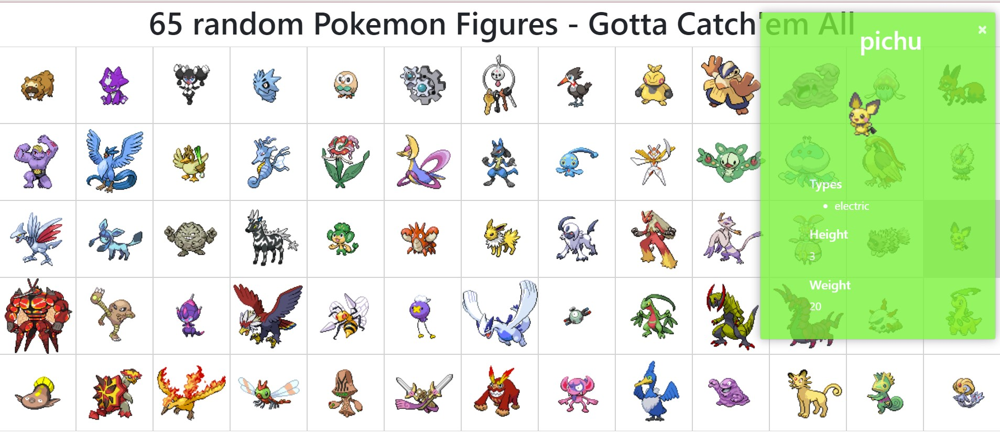

# Gotta-Catch-em-All - API use

I design a HTML file showing randomly 65 pokemons using a API to obtain some characteristics about them.

Database is read in JSON format.

I use toastr, a Javascript responsive interface to show the information about the selected pokemon.

A few screenshots:

  **This is an exercise of full-Stack Python Bootcamp offered by coding dojo**
##### *keep trying, knowledge is awesome*  :facepunch:

To see it, download the HTML file and make sure your device has internet.
